# Fitness & Nutrition Data Pipeline

## Project Overview

This project builds a comprehensive ETL pipeline that integrates multiple fitness and nutrition datasets to provide personalized health recommendations. The system focuses on four main fitness goals: lose weight, build muscle, train for endurance, and maintain a healthy lifestyle.

## Part 1 Deliverable 

This repository contains the initial implementation focusing on data integration, cleaning, and database setup using MySQL.

### Datasets Integrated

1. **Fitbit Dataset** (CSV)
   - Daily activity, heart rate, calories, weight, and sleep data
   - Source: https://www.kaggle.com/datasets/arashnic/fitbit

2. **Gym Members Dataset** (CSV)
   - Member profiles with workout preferences and metrics
   - Source: https://www.kaggle.com/datasets/valakhorasani/gym-members-exercise-dataset

3. **Mendeley Health Dataset** (CSV)
   - Health conditions, fitness goals, and workout preferences
   - Source: https://data.mendeley.com/datasets/zw8mtbm5b9/1

4. **USDA Nutrition Dataset** (JSON)
   - Comprehensive food nutritional information
   - Source: https://www.kaggle.com/datasets/gokulprasantht/nutrition-dataset

## Architecture

### ETL Pipeline Components

1. **Extract**: read the raw data
2. **Transform** the data into the star schema
   - Unifying users
   - Parsing text blobs into keys
   - Creating fact and dimension dataframes
3. **Load** the data into the data warehouse.

### Database Schema

This project builds an **Online Analytical Processing (OLAP)** data warehouse using a **snowflake schema**.

This model is optimized for high-speed, complex `GROUP BY` and `JOIN` queries essential for analytics.
- **Fact Tables**: Store the measures or numbers.
- **Dimension Tables**: Store the context or categories.
- **Bridge Tables**: Connect dimensions with many-to-many relationships (e.g., a User can have many Health Conditions).

```mermaid
erDiagram
    %% --- Fact Tables ---
    Fact_UserSnapshot {
        int SnapshotKey PK
        int UserKey FK
        int GoalKey FK
        int TypeKey FK
        decimal Height
        decimal Weight
        decimal BMI
    }
    Fact_WorkoutSession {
        int SessionKey PK
        int UserKey FK
        int DateKey FK
        int WorkoutTypeKey FK
        decimal DurationHours
        int CaloriesBurned
        int TotalSteps
    }
    Fact_HealthMetric {
        int MetricKey PK
        int UserKey FK
        int DateKey FK
        int MetricTypeKey FK
        decimal Value
        string Unit
    }
    Fact_NutritionLog {
        int LogKey PK
        int UserKey FK
        int DateKey FK
        int MealTypeKey FK
        int FoodKey FK
        decimal ServingSize
        decimal TotalCalories
        decimal TotalProtein
        decimal TotalCarbs
        decimal TotalFats
    }

    %% --- Dimensions ---
    Dim_User {
        int UserKey PK
        string Source
        int Age
        string Gender
    }
    Dim_Date {
        int DateKey PK
        date FullDate
        int Year
        int Month
    }
    Dim_FitnessGoal {
        int GoalKey PK
        string GoalName
    }
    Dim_FitnessType {
        int TypeKey PK
        string TypeName
    }
    Dim_FoodItem {
        int FoodKey PK
        string FoodName
        decimal Calories
    }
    Dim_WorkoutType {
        int WorkoutTypeKey PK
        string WorkoutName
    }
    Dim_MetricType {
        int MetricTypeKey PK
        string MetricName
    }
    Dim_MealType {
        int MealTypeKey PK
        string MealName
    }

    %% --- Snowflake Dimensions ---
    Dim_HealthCondition {
        int ConditionKey PK
        string ConditionName
    }
    Dim_Exercise {
        int ExerciseKey PK
        string ExerciseName
    }
    Dim_Diet {
        int DietKey PK
        string DietName
    }

    %% --- Bridge Tables ---
    
    Bridge_User_HealthCondition {
        int UserKey FK
        int ConditionKey FK
    }
    Bridge_User_WorkoutPreference {
        int UserKey FK
        int ExerciseKey FK
    }
    Bridge_User_DietPreference {
        int UserKey FK
        int DietKey FK
    }

    %% --- Relationships ---
    Fact_UserSnapshot }|--|| Dim_User : "links to"
    Fact_UserSnapshot }|--|| Dim_FitnessGoal : "links to"
    Fact_UserSnapshot }|--|| Dim_FitnessType : "links to"

    Fact_WorkoutSession }|--|| Dim_User : "belongs to"
    Fact_WorkoutSession }|--|| Dim_Date : "occurred on"
    Fact_WorkoutSession }|--|| Dim_WorkoutType : "is a"

    Fact_HealthMetric }|--|| Dim_User : "belongs to"
    Fact_HealthMetric }|--|| Dim_Date : "measured on"
    Fact_HealthMetric }|--|| Dim_MetricType : "is a"

    Fact_NutritionLog }|--|| Dim_User : "belongs to"
    Fact_NutritionLog }|--|| Dim_Date : "logged on"
    Fact_NutritionLog }|--|| Dim_FoodItem : "of food"
    Fact_NutritionLog }|--|| Dim_MealType : "for meal"

    Dim_User ||--o{ Bridge_User_HealthCondition : "has"
    Dim_HealthCondition ||--o{ Bridge_User_HealthCondition : "applies to"

    Dim_User ||--o{ Bridge_User_WorkoutPreference : "prefers"
    Dim_Exercise ||--o{ Bridge_User_WorkoutPreference : "is"

    Dim_User ||--o{ Bridge_User_DietPreference : "prefers"
    Dim_Diet ||--o{ Bridge_User_DietPreference : "is"
```

