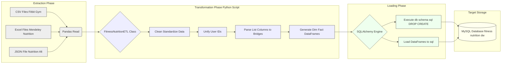

```mermaid
graph LR
    subgraph Extraction [Extraction Phase]
        A["CSV Files Fitbit Gym"]
        B["Excel Files Mendeley Nutrition"]
        C["JSON File Nutrition Alt"]
        P1(Pandas Read)

        A --> P1
        B --> P1
        C --> P1
    end

    subgraph Transformation [Transformation Phase Python Script]
        direction TB
        T1{FitnessNutritionETL Class}
        T2[Clean Standardize Data]
        T3[Unify User IDs]
        T4[Parse List Columns to Bridges]
        T5[Generate Dim Fact DataFrames]

        P1 --> T1
        T1 --> T2
        T2 --> T3
        T3 --> T4
        T4 --> T5
    end

    subgraph Loading [Loading Phase]
        direction TB
        L1{SQLAlchemy Engine}
        L2["Execute db schema sql DROP CREATE"]
        L3["Load DataFrames to sql"]

        T5 --> L1
        L1 --> L2
        L1 --> L3
    end

    subgraph Target_Storage [Target Storage]
        %% Use cylinder shape for database
        DB[("MySQL Database fitness nutrition dw")]

        L2 --> DB
        L3 --> DB
    end

    %% Styles
    classDef extraction fill:#eee,stroke:#333,stroke-width:1px;
    classDef transformation fill:#eef,stroke:#333,stroke-width:1px;
    classDef loading fill:#efe,stroke:#333,stroke-width:1px;
    classDef storage fill:#ffe,stroke:#333,stroke-width:1px;

    class A,B,C,P1 extraction;
    class T1,T2,T3,T4,T5 transformation;
    class L1,L2,L3 loading;
    class DB storage;

```
